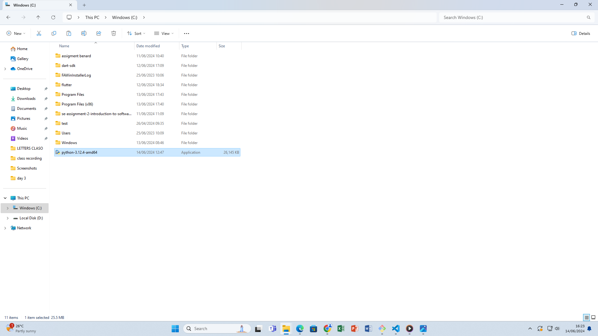
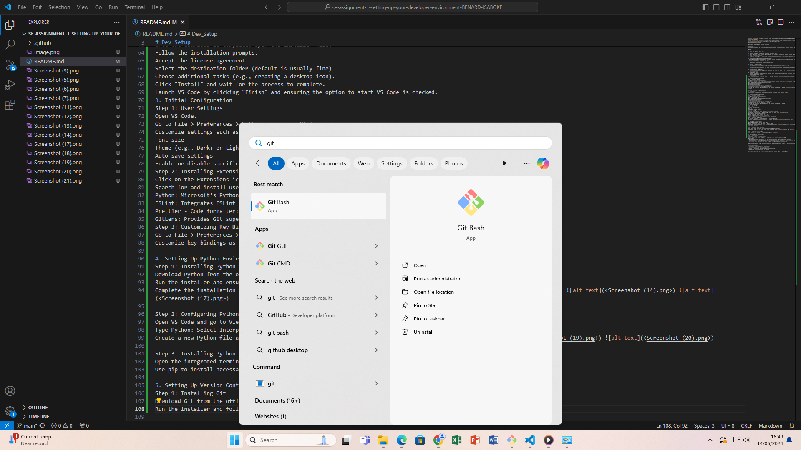
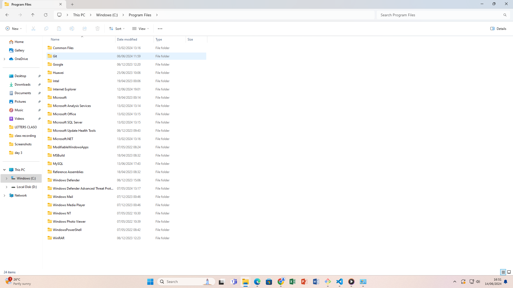

# Dev_Setup
Setup Development Environment

#Assignment: Setting Up Your Developer Environment

#Objective:
This assignment aims to familiarize you with the tools and configurations necessary to set up an efficient developer environment for software engineering projects. Completing this assignment will give you the skills required to set up a robust and productive workspace conducive to coding, debugging, version control, and collaboration.

#Tasks:

1. Select Your Operating System (OS):
   Choose an operating system that best suits your preferences and project requirements. Download and Install Windows 11. https://www.microsoft.com/software-download/windows11

2. Install a Text Editor or Integrated Development Environment (IDE):
   Select and install a text editor or IDE suitable for your programming languages and workflow. Download and Install Visual Studio Code. https://code.visualstudio.com/Download
3. Set Up Version Control System:
   Install Git and configure it on your local machine. Create a GitHub account for hosting your repositories. Initialize a Git repository for your project and make your first commit. https://github.com

4. Install Necessary Programming Languages and Runtimes:
  Instal Python from http://wwww.python.org programming language required for your project and install their respective compilers, interpreters, or runtimes. Ensure you have the necessary tools to build and execute your code.

5. Install Package Managers:
   If applicable, install package managers like pip (Python).

6. Configure a Database (MySQL):
   Download and install MySQL database. https://dev.mysql.com/downloads/windows/installer/5.7.html

7. Set Up Development Environments and Virtualization (Optional):
   Consider using virtualization tools like Docker or virtual machines to isolate project dependencies and ensure consistent environments across different machines.

8. Explore Extensions and Plugins:
   Explore available extensions, plugins, and add-ons for your chosen text editor or IDE to enhance functionality, such as syntax highlighting, linting, code formatting, and version control integration.

9. Document Your Setup:
    Create a comprehensive document outlining the steps you've taken to set up your developer environment. Include any configurations, customizations, or troubleshooting steps encountered during the process. 
    1. Introduction
This document outlines the steps taken to set up a developer environment using Visual Studio Code (VS Code) as the primary text editor. It includes installation instructions, configurations, customizations, and troubleshooting steps encountered during the setup process.

2. Installation of Visual Studio Code
Step 1: Downloading VS Code
Navigate to the Visual Studio Code website.
Click on the download button for your operating system (Windows, macOS, or Linux)..png>)
Step 2: Installing VS Code
Once the download is complete, open the installer file.
Follow the installation prompts:
Accept the license agreement.
Select the destination folder (default is usually fine).
Choose additional tasks (e.g., creating a desktop icon).
Click "Install" and wait for the process to complete.
Launch VS Code by clicking "Finish" and ensuring the option to start VS Code is checked. .png>) .png>) .png>)

Developer Environment Setup Documentation
1. Introduction
This document outlines the steps taken to set up a developer environment using Visual Studio Code (VS Code) as the primary text editor. It includes installation instructions, configurations, customizations, and troubleshooting steps encountered during the setup process.

2. Installation of Visual Studio Code
Step 1: Downloading VS Code
Navigate to the Visual Studio Code website.
Click on the download button for your operating system (Windows, macOS, or Linux).
Step 2: Installing VS Code
Once the download is complete, open the installer file.
Follow the installation prompts:
Accept the license agreement.
Select the destination folder (default is usually fine).
Choose additional tasks (e.g., creating a desktop icon).
Click "Install" and wait for the process to complete.
Launch VS Code by clicking "Finish" and ensuring the option to start VS Code is checked.
3. Initial Configuration
Step 1: User Settings
Open VS Code.
Go to File > Preferences > Settings or press Ctrl+,.
Customize settings such as:
Font size
Theme (e.g., Dark+ or Light+)
Auto-save settings
Enable or disable specific editor features (e.g., line numbers, minimap)
Step 2: Installing Extensions
Click on the Extensions icon in the Activity Bar on the side of the window or press Ctrl+Shift+X.
Search for and install useful extensions:
Python: Microsoft’s Python extension for VS Code.
ESLint: Integrates ESLint JavaScript into VS Code.
Prettier - Code formatter: Ensures code is formatted consistently.
GitLens: Provides Git superpowers.
Step 3: Customizing Key Bindings
Go to File > Preferences > Keyboard Shortcuts or press Ctrl+K Ctrl+S.
Customize key bindings as per your preference or workflow requirements. .png>)

4. Setting Up Python Environment
Step 1: Installing Python
Download Python from the official Python website.
Run the installer and ensure "Add Python to PATH" is checked.
Complete the installation process. .png>)  .png>) .png>) .png>)

Step 2: Configuring Python in VS Code
Open VS Code and go to View > Command Palette or press Ctrl+Shift+P.
Type Python: Select Interpreter and choose the installed Python interpreter.
Create a new Python file and write a simple script to test the setup. .png>) .png>) .png>)

Step 3: Installing Python Packages
Open the integrated terminal in VS Code by pressing Ctrl+ ` (backtick).
Use pip to install necessary packages, e.g., pip install numpy.

5. Setting Up Version Control with Git
Step 1: Installing Git
Download Git from the official Git website.
Run the installer and follow the prompts to install Git. .png>)   .png>)

Step 2: Configuring Git in VS Code
Open VS Code and go to View > Command Palette or press Ctrl+Shift+P.
Type Git: Clone and enter the repository URL to clone a repository.
Use the Source Control view in the Activity Bar to manage version control. .png>) .png>)

A GitHub repository containing a sample project initialized with Git and any necessary configuration files (e.g., .gitignore). https://github.com/BENARD-ISABOKE/se-assignment-1-setting-up-your-developer-environment-BENARD-ISABOKE.git  -1.png>)

6. Troubleshooting
Common Issues and Solutions
VS Code not recognizing Python:
Ensure Python is added to the system PATH.
Verify the correct interpreter is selected in VS Code.
Extensions not installing:
Check internet connection.
Restart VS Code and try reinstalling the extension.

7. Conclusion
By following the steps outlined in this document, a robust and efficient developer environment can be set up using Visual Studio Code. This setup supports Python development and integrates essential tools like Git for version control. Customizations and extensions further enhance productivity and tailor the environment to specific workflow requirements.

#Deliverables:
- Document detailing the setup process with step-by-step instructions and screenshots where necessary.
- A GitHub repository containing a sample project initialized with Git and any necessary configuration files (e.g., .gitignore).
- A reflection on the challenges faced during setup and strategies employed to overcome them.

#Submission:
Submit your document and GitHub repository link through the designated platform or email to the instructor by the specified deadline.

#Evaluation Criteria:**
- Completeness and accuracy of setup documentation.
- Effectiveness of version control implementation.
- Appropriateness of tools selected for the project requirements.
- Clarity of reflection on challenges and solutions encountered.
- Adherence to submission guidelines and deadlines.

Note: Feel free to reach out for clarification or assistance with any aspect of the assignment.
